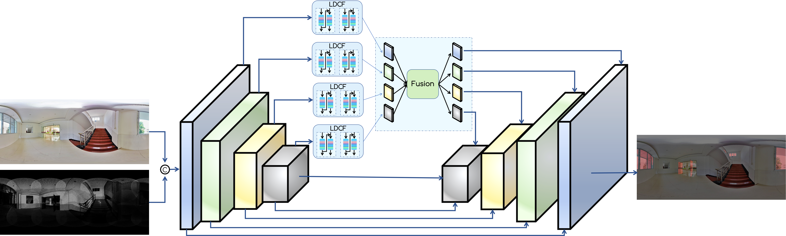

# RGB-T-Glass-Segmentation

Code for this paper [PanoGlass:Glass Detection with panoramic RGB and intensity images]

## Overview

Glass detection is an important task for downstream vision systems that rely on it, such as 3D reconstruction and depth estimation, because the trans-
parency of glass can mislead them and cause incorrect results. A panoramic image, which is usually composed of four or more perspective images, can
provide a wider field of view (FOV) and include more objects. Therefore, glass detection based on panoramic images can be more robust and practical
for complex and realistic environments and offer more dependable support for downstream vision systems. However, to the best of our knowledge, there is
no existing research on glass detection based on panoramic images, and most glass detection models are trained on perspective images. As the first work in
this direction, we construct a panoramic glass detection dataset (PanoGlass) and design a panoramic glass detection model (PanoGlass) that captures the
wide FOV and twisted boundary by using a large-field contextual feature integration-half branch version with deformable convolution (HDCN). Extensive and comprehensive experiments on our dataset show that our model performs comparably with state-of-the-art methods.

## Motivation

A panoramic image, which is usually composed of four or more perspective images, can provide a wider field of view (FOV) and include more objects.

  

## Architecture

Our architecture follows the standard encoder-decoder framework with skip-connections, which consists of two encoding branches, one decoding branch and a multi-modal fusion module (MFM) as the bridge.
Our architecture follows the strandard encoder-decoder framework which consists of one encoding branch, one decoding branch, four HDCN modules and a fusion module.

  

## Datasets

The datasets utilized in our paper can be downloaded via the links below:
- [PanoGlass-vocStructure Google Drive](https://drive.google.com/file/d/1CWmIFZUbP_WIsYzSso4ZzAdMGKXK0z5Q/view?usp=sharing)
- [PanoGlass-vocStructure Baidu Drive](https://pan.baidu.com/s/142XKl7Zy7mJ5ar6J4X8MZg) code:pano
- [RGBT](https://drive.google.com/file/d/1ysG04qGmnZv7UaybZUuyybaJYJLUkNHX/view)
- [Trans10K-v2](https://drive.google.com/file/d/1YzAAMY8xfL9BMTIDU-nFC3dcGbSIBPu5/view)

## Prerequisites
- Python 3.10.6 
- PyTorch 2.0.0
- Requirements: mmsegmentation
- Platforms: Ubuntu 22.04, RTX A6000, cuda-11.8

## Training

python3 tools/train.py configs/PanoGlass/myDecoder_convnext_xlarge_fp16_640x640_80k_voc12.py --no-validate

## Testing

python3 tools/test.py configs/PanoGlass/myDecoder_convnext_xlarge_fp16_640x640_80k_voc12.py work_dirs/myDecoder_convnext_xlarge_fp16_640x640_80k_voc12/iter_80000.pth --eval mFscore --show-dir show-prtsc

Download the well-trained models ([PanoGlass])(https://drive.google.com/file/d/1NVkxwP-zlQfvb9XYCQB3MP6AE-_K8JxH/view?usp=sharing)

## Citation

If you use this code and data for your research, please cite our paper.

